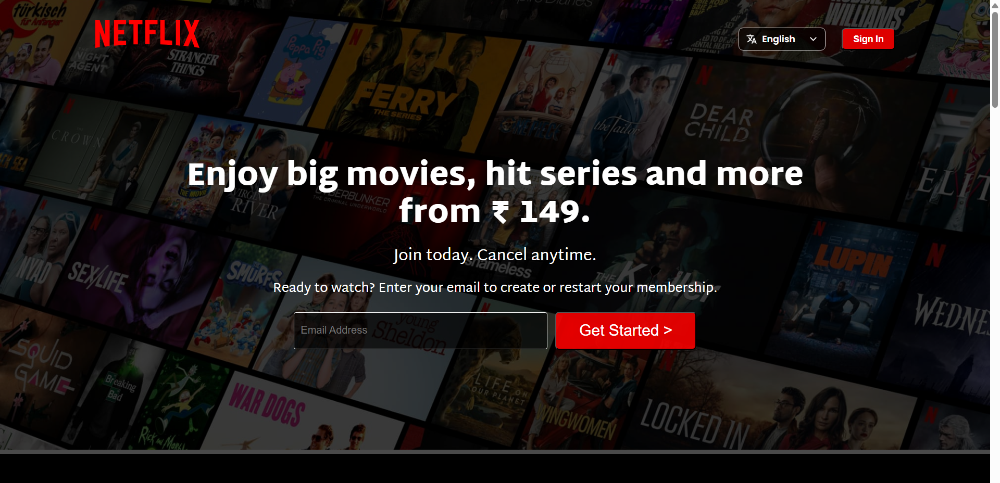

# Netflix Clone

A responsive Netflix landing page clone built using HTML5 and CSS3. This project recreates Netflix's homepage with a clean and responsive user interface.

## 📸 Preview



---

## ✨ Features

- Responsive design
- Hero section with background overlay
- Feature showcase sections
- Embedded promotional videos
- FAQ section
- Netflix-inspired footer

---

## 🛠️ Tech Stack

- HTML5
- CSS3

---

## 📂 Project Structure

```
netflix-clone/
│── assets/
│   ├── images/
│   └── videos/
│── screenshots/
│   └── netflix-clone.png
│── index.html
│── style.css
└── README.md
```

---

## 🚀 Getting Started

1. Clone the repository
2. Open `index.html` in your browser

---

## 📄 License

This project is created for learning and portfolio purposes only.

---

## ⚠️ Disclaimer

This project is a frontend clone created for educational and portfolio purposes only.

Netflix is a trademark of Netflix, Inc. This project is not affiliated with, endorsed by, or sponsored by Netflix.